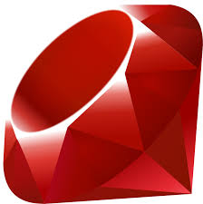
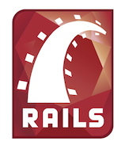
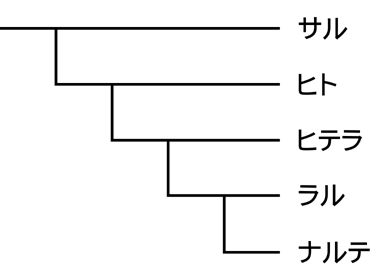
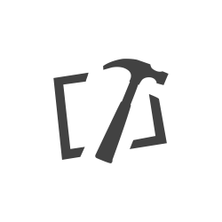
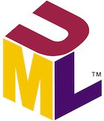

# わたし、Preziやめます
ver. 0.7

---
## 目次
- 2013年総括案
- 2014年方針案
- 長期的展望

---
## 2013年総括案
### 良かったこと
- 少人数の勉強会は良いとわかった
- Railsが源流なのだとわかった
- **コードのあるべき姿がわかった**
- 自信がついた
- 反転授業を実施することができた

### 悪かったこと
- 上司対応がうまくいかなかった
- 無茶な要求を拒否できなかった
- 予定を入れすぎた
- オンとオフの切り替えができていなかった
- 手を広げすぎた

---
## 2014年方針案

### やること
- Objective-Cで、当たり前のコードを書けるようになる

### やらないこと
- サーバサイド
- Rails
- Express / Node.js
- Appium / Capybara / RSpec / Cucumber
- 受け入れテスト

### *気分転換としてやること？*
- ツールとしてのNode.js

---
## 長期的展望

### 最終的目標
- 学習用の仮想物理実験室をJS/HTML5で書くこと

###課題
- 時期尚早。もう少しJSアプリケーション・フレームワークが成熟してから

## 中期目標
- 学習用の仮想物理実験室をObjective-Cで書くこと

---
# 2013年総括案

---
#良かったこと

---
## 少人数の勉強会は良いとわかった



---
1月にTDD勉強会を立ち上げることができた。[@shida](https://twitter.com/shida)さんと[@utwang](https://twitter.com/utwang)くんと友達になることができた。RSpecの書き方がわかった。受け入れテストとはどのようなものなのかわかった。良かった！

2人とは、それ以後も飲み友達になった。飲むたびに「おおお」と言いたくなるような刺激をもらえる。ありがたい！

---


また、今回の「3人」のような「少人数の勉強会」が意外に良いことがわかった。勉強会に適した人数は5人くらいなのではないかと感じた。

2014年も3人くらいの勉強会に（自分は幹事とならずに）参加したい。

---
## Railsが源流なのだとわかった



[@jishiha](https://twitter.com/jishiha)さんにRailsを教わった。大変使いやすい。これは良いものを教えていただいた！

---


あとから、サーバサイドは現状ではRails以外の選択肢はないと言って良いくらい、共有されているノウハウの量が完全に段違いであることを知ることができた。Railsを前提にいろいろなライブラリが作られている。

---


Railsは、CakeやSinatraといった様々なものに影響を与えた、Webの世界の思想の源流であることがわかった。いわば源流。そういう思想の流れる様子を見ることができて良かった。

あれこれ手を出さず、サーバサイドをやるならRailsに注力すべき。だが2014年はサーバサイドはやらない予定なので、Railsも我慢する。

---
## コードのあるべき姿がわかった（重要）

---


2万行のObjective-Cプロジェクトに取り組み、コードとはどう書かれるべきかがわかった！

---


- メソッドとクラスを機能毎に切り分けて、
- わかりやすい名前を付けることが、本当に本当に大切
- 長いメソッド、長いクラスは良くない
- IDEの「メソッドの抽出」は便利

2014年は、これらの事柄を意識してプログラムを書く。

---


- 既存コードの分析やその共有にUMLが便利

2万行プロジェクトのときは[@nekomimimi](https://twitter.com/nekomimimi)さんに助けられた。いつもObjective-Cで自分ではどうにもならないとき、何の対価も要求せずに優しく教えてくれる。大変ありがたい。

---
## 自信がついた


幾つもの下請けに出したという要件を満たすコードを、自分だけが書けた。このことから、自分のコーティング力が平均よりは高いことがわかった。自信になった！

---
## 反転授業を実施することができた


---
- かつて教材は教科書だけだったが、今や情報技術の進歩により、動画やインタラクティブな教材が急激に増えている。反転授業とは、このような先進的な学習教材を授業前に生徒が視聴し、授業では疑問点を質問したりグループで討論したり何らかの課題に適用してみる、といったことを行うような授業である。

- プログラマーズカフェでハンズオン形式の授業内反転授業を行うことができたのは、良い経験になった。

---


- また、これは別の機会に気づいたことだが、教材は音声が付いていた方が良いとわかった。音声の方が学習者にとってラクである。

- ただし、教育系の事柄は2014年には手を付けない。我慢する。

---
# 悪かったこと


2013年は、二度体調を崩した。

---
## 上司対応がうまくいかなかった


- 2013年は、緩衝材となるべき上司が、お客さんの要求をそのまま筒抜けに私に渡してきた。そして、私はそれを受け取ってしまった。

- 2014年は、お客さんの声を直接聞かず、上司から聞くようにすることで、お客さんのプレッシャーを吸収してもらう。客のプレッシャーを受けた上司が私にプレッシャーをかけてきたら、かわすか抗議する。

---
## 無茶な要求を拒否できなかった


- 2013年は、無茶な要求に無理に対応しようとした。具体的には、OpenSSLとOpenGL。できません、と言えなかった。

- 2014年は、できないものはできないと早めに断る。

- そして、Objective-Cは「普通の言語」ではないことを、その都度その都度、丹念に説明していく（例えば電池量は5%刻みでしか取得できない、等）。

---
## 予定を入れすぎた


- 2013年は予定を入れ過ぎた。
- 3ヶ月先まで予定が入っていたりした。
- 勉強会の責任者やハンズオンの講師やグループ学習のリーダーは、予想以上に負担になった。

---
## スケジュール
- 2014年は、1ヶ月以上先には予定を入れない。
- そして、1周間に入れるイベントは1つか、軽い負担のイベント（映画を見に行くとか）2つ。
- 平日の夜のイベントには出ない。
- 金曜の夜でも土曜の午前中に用事がある場合は飲みに行ったりしない。

## 責任者
- 勉強会の責任者はやらない。ハンズオンの講師もやらない。リーダーもやらない。
- 代わりに誰か他の人にやってもらう。自分はバックグラウンドで動くが、責任者にはならない。

---
## オンとオフの切り替えができていなかった


- 2013年は、オフのときもプログラミングしていた。iPad miniセルラー版から膨大な情報がリアルタイムに流れ込んできて辛かった。

- 2014年は、オフのときは別のことをする。歴史友達を見つける。歴史散歩に出かける。歴史ブログを充実させる。まちクエする。

---
## 手を広げすぎた

2013年は様々なものに手を出した。

- Rails
- Node.js
- HTML5 Canvas
- HTML5 オフラインキャッシュ
- yeoman
- Bower

---
- Parse.com
- Backbone
- Knockout.js
- Ubuntu
- OpenGL
- Jasmine
- Express
- Bootstrap
- RSpec
- RubyMine

・・・等など。

---
- 我ながら笑ってしまう。
- でも、楽しかった。
- 自分は新しいものが好きだ。だからこの業界が合っている。
- いろいろ見てみることは2014年もやろう。
- ただし、見て楽しむに**「とどめる」**。
- これができるようになりたい。

2014年は戦力を拡散させずに、集中して運用する。原則としてObjective-Cのみをやる。

---
# 2014年方針案

---
## やること

「メンテナンス可能なプロダクトをリリースする」という、当たり前のことができるようになる。それが今年の目標。これができなければ話にならない。基礎体力。


---
## 「メンテナンス可能」
とは、

- 機能ごとにクラスや関数が適切な長さに分けられ、
- それらの名前がきちんと付けられていて可読性が高いということと、
- テストコードがちゃんと書かれているということ。

---
- 『レガシーコード改善ガイド』に従って、長いメソッドは分割し、わかりやすい名前をつけ、テストコードを書き、リファクタリングする。

- 楽しみながらやりたい。コードレビューしてもらったり、LTして意見を聞いたりしてフィードバックをもらいながら進められると良い気がする。

---
## やらないこと

今年はサーバサイドはやらない。

- Railsも
- Express / Node.jsも、

やりたいけどやらない。

---
地道に既存のObjective-Cのレガシーコードを整理し、機能毎にメソッド・クラスに分け、テストを入れていく。

- Appium
- RSpec
- Capybara
- Cucumber

とか気になるけどやらない。でも記事はチェックする。

---
とりあえずGHUnitで低レベルのテストを書いていく。

- 受け入れテスト

はやりたいけどやらない。まずはユニットテストから。とにかく基礎体力をつけることに集中して、他は捨てる。

---
## *気分転換としてやること？*

- ただ、気分転換としてNode.js自体はやりたい。
- なぜかというと将来的にはJSにシフトしたいから。
- Node.jsの新しいモジュールは雨後の竹の子のように生まれているので、
- それを追いかけるのは楽しそう。
- あくまで気分転換。
- 見るだけ。
- どうか？

---
# 長期的展望

---
## DEMO
[Interactive Physics紹介](http://www.youtube.com/watch?v=rOri3-iCzCM)

---
## 最終的目標

- 学習用の物理動画サイトをつくること
- 学習用の仮想物理実験室をJS/HTML5で書くこと

---
## 要素技術

- JavaScript / CoffeeScript
- Canvas 2D フレームワーク（GUIでコード編集できるものが望ましい）
- JSアプリケーション・フレームワーク（ビューに強いものが望ましい）
- [PhysicsJS](http://wellcaffeinated.net/PhysicsJS/)、あるいはそれに類する物理演算ライブラリ
- リアルタイム・グラフプロッター（jqplotで大丈夫か？）
- サーバサイド（Railsになるかは未定。要るのかどうかも未定。）
- ？

---
## 課題

時期尚早。もう少しJSアプリケーション・フレームワークが成熟してから手を出したい。

---
## 中期目標

学習用の仮想物理実験室をObjective-Cで書くこと

---
## 要素技術

- Objective-C
- SpriteKit
- Box2D（物理演算ライブラリ、古いか？）
- ？

---
*One More Thing...*

---
## Preziの問題点

- 作るのが大変、とにかく時間がかかる
- あとで記事にするのが大変
- SlideShareなどと比べて、あまり見てもらえない
- かけた労力に見合わない

---
## Markdownでプレゼンテーション

mdpressというgemを使う。

```
$ mdpress readme.md
```

これだけで *readme* というフォルダが作成され、その中の *index.html* を開くとプレゼンテーションが始まる。

---
##簡単な例

    # Chicken Chicken Chicken
    ## By Chicken
    
    ---
    
    # Chicken
    - Chicken
    - Chicken Chicken

---
# Chicken Chicken Chicken
## By Chicken

---
# Chicken
- Chicken
- Chicken Chicken

---
## mdpressの良いところ

- Markdown最高！
- とりあえずLT用に見出しだけ作って、
- LT後に加筆すれば記事になる
- できた記事をQiitaなりはてなブログなりに貼り付ければパブリッシュ完了
- 無駄がないワークフロー

---
##シンタックスハイライト：Ruby

```
configure :production do
  set :cache, Dalli::Client.new(
    ENV['MEMCACHE_SERVERS'],
    :username => ENV['MEMCACHE_USERNAME'],
    :password => ENV['MEMCACHE_PASSWORD'],
    :expires_in => 60 * 30
  )
end
```

---
## シンタックスハイライト：Objective-C

```
NSBundle* bundle = [NSBundle mainBundle];
NSString* path = [bundle pathForResource:@"Questions" ofType:@"plist"];
questions = [NSArray arrayWithContentsOfFile:path];
QuestionsMax = questions.count;

for(NSDictionary* question in questions) {
    NSLog(@"question:%@", [question objectForKey:@"Question"]);
    NSLog(@"answer:%@", [question objectForKey:@"CorrectAnswer"]);
    NSLog(@"incorrect answer:%@", [question objectForKey:@"IncorrectAnswer"]);
    NSLog(@"backgroundImage:%@", [question objectForKey:@"backgroundImage"]);
}
```

---
では作ったプレゼンテーションをどこに置くか？

---
# GitHub Pagesでプレゼンテーション

---
DEMO

---
## つくり方
1. まず、普通にMarkdown文書を作る
2. `$ mdpress readme.md`でプレゼンテーションが *readme* フォルダに作られる
2. originブランチにpush
3. Setting -> GitHub Pagesで空のGitHub Pagesをつくる
4. gh-pagesブランチがGitHub上にできる
5. pullするとgh-pagesブランチもローカルに付いてくる
6. `$ git checkout gh-pages`
7. `$ cp -rf readme/* .`
8. `$ git push -u origin gh-pages` （最初だけ）
9. `$ git push` （2回目以降）

---
## 良いところ
- 改訂したとき、diffが見れる
- プルリクも送ることができる
- ソース(Markdown)とプレゼンテーション(HTML)を同じ一つのリポジトリで管理できる
- Qiitaやはてなブログのように、画像を一枚一枚アップしなくて良い
- LT後の質疑などの内容を、筆者だけでなく聞いた人もプルリクで追記できる

---
## 悪いところ
		
更新がややこしい

---
## 更新のやり方		
1. [origin] まずoriginブランチであるか確認
1. [origin] Markdownに追記
1. [origin] Markdownエディタを終了
1. [origin] git push
1. [origin] mdpressでリポジトリとは別のフォルダにプレゼン作成
1. [gh-pages] gh-pagesブランチに切り替える
1. [gh-pages] プレゼンをリポジトリにコピー
1. [gh-pages] git push
1. [origin] originブランチに戻しておく

---
## push.sh

```
# レポジトリに入る
# フォルダ名は引数にしたい
cd 140127-2013-soukatsu-2014-houshin

# Markdownをpush
git add .
git commit -m "commited automatically by push.sh"
git push

# mdpressコマンドでreadmeフォルダを生成
cd ..
mdpress 140127-2013-soukatsu-2014-houshin/readme.md

# gh-pagesブランチに切り替える
cd 140127-2013-soukatsu-2014-houshin
git checkout gh-pages
```

---
```
# 先ほど生成したreadmeフォルダの中身をレポジトリにコピーする
cp -rf ../readme/* .

# 自動的にcommit＋push
git add .
git commit -m "commited automatically by push.sh"
git push

# originブランチに戻す
git checkout master

# 元いたディレクトリに戻る
cd ..


```

---
- いちおう自動化できた！
- どうやったら汎用的に使えるようになるんだろう？
- つくったら使ってくれる人いるかな？

---
というわけで、

# わたし、Preziやめます
以上